<head>
  <style>
    img{
        display:block;
        margin: 0 auto;
    }
  </style>
</head>
<h1>단비 - 장애인을 위한 도움중계 플랫폼</h1>
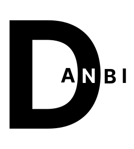

# 목차
<ul>
    <li><a href="#소개">프로젝트 소개</a></li>
    <li><a href="#서비스화면">서비스 화면</a></li>
    <li><a href="#아키텍처">아키텍처</a></li>
    <li><a href="#ERD">ERD</a></li>
    <li><a href="#Stack">Stack</a></li>
    <li><a href="#협업">협업</a></li>
    <li><a href="#주요기능">주요기능</a></li>
    <li><a href="#Git컨벤션">Git컨벤션</a></li>
    <li><a href="#팀소개">역할 및 팀원 소개</a></li>
</ul>

<h1 id="소개">🔎 프로젝트 소개</h1>

## **🥇SSAFY 공통 프로젝트 우수상**
- <a href="">단비 - 장애인을 위한 도움중계 플랫폼</a>
- 사회적으로 취약한 계층을 위한 도움을 연결하고 제공하는 플랫폼입니다. 따뜻한 마음을 가진 이웃과 필요한 지원을 필요로 하는 이들을 연결하여 더 나은 세상을 만들어가는데 도움을 줍니다.
- 프론트(React) + 2개의 서버(Spring, Express.js)기반으로 구성된 프로젝트
- 개발 기간 : 2023.07 ~ 2023.08

<h1 id="서비스화면">주요 서비스 화면</h1>
<ul>
    <li>
        <div>로그인</div>
        
    </li>
    <li>Impairment
        <ul>
            <li>
                <div>도움 요청하기</div>
                </li>
            <li>
                <div>도움 긴급요청하기</div>
                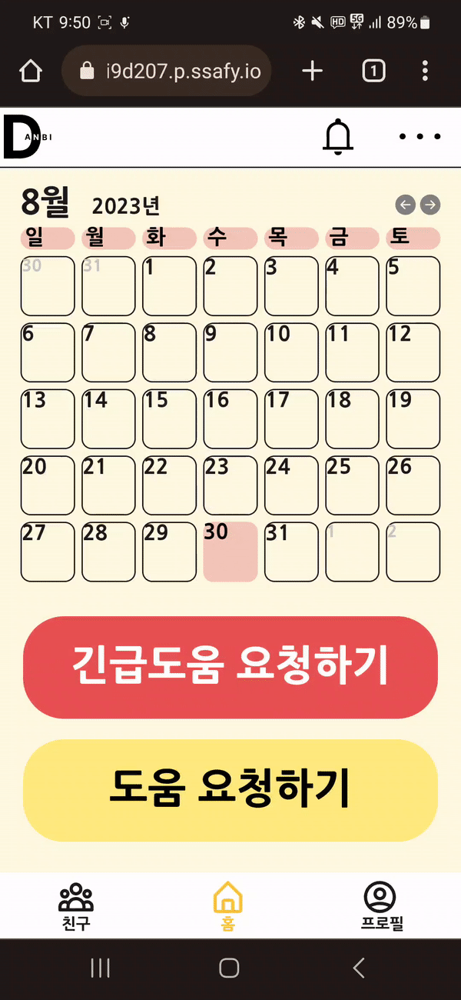</li>
        </ul>
    </li>
    <li>Helper
        <ul>
            <li>
                <div>도움 주기</div>
                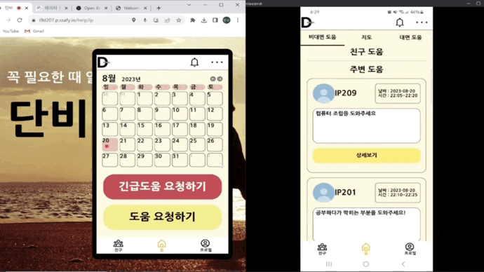
            </li>
            <li>
                <div>상세화면</div>
                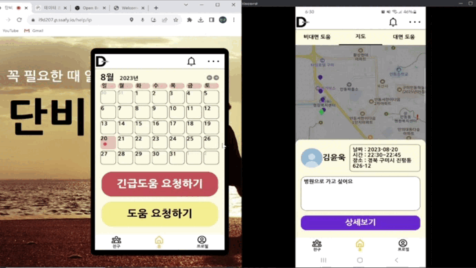
            </li>
        </ul>
    </li>
    <li>도움 매칭 화면
        <ul>
            <li>
                <div>도움정보 확인 화면</div>
                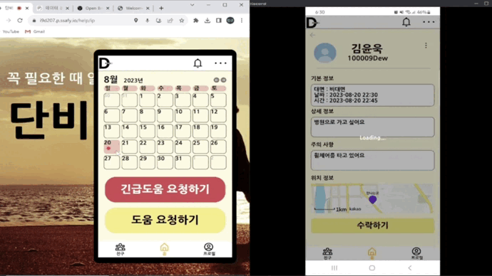
            </li>
            <li>
                <div>소통 화면</div>
                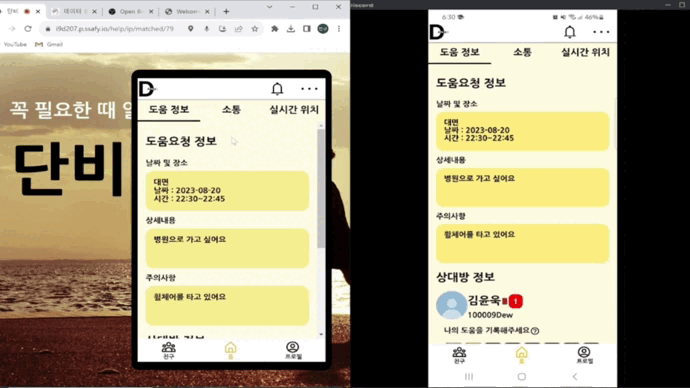
            </li>
            <li>
                <div>실시간 위치</div>
                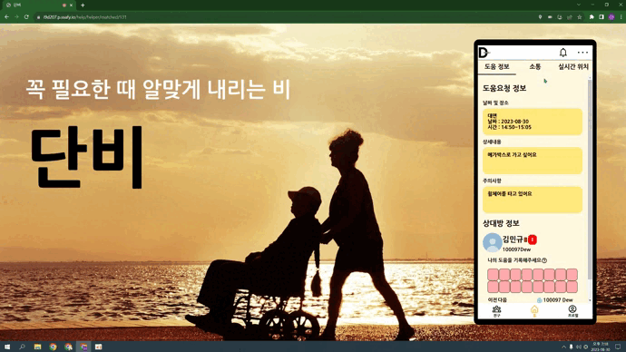
            </li>
        </ul>
    </li>
    <li>프로필
        <ul>
            <li>
                <div>도움기록 꾸미기 - 뽑기</div>
                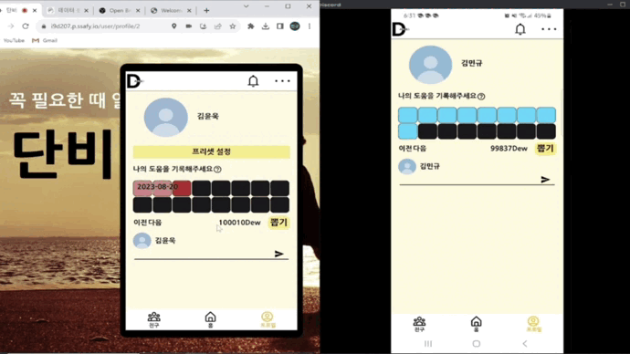
            </li>
        </ul>
    </li>
    <li>
        <div>신고</div>
        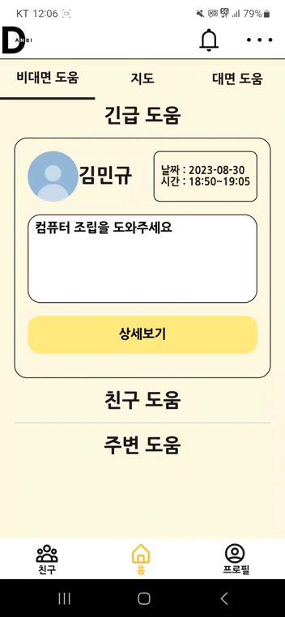
    </li>
</ul>

<h1 id="아키텍처">🚋아키텍처</h1>

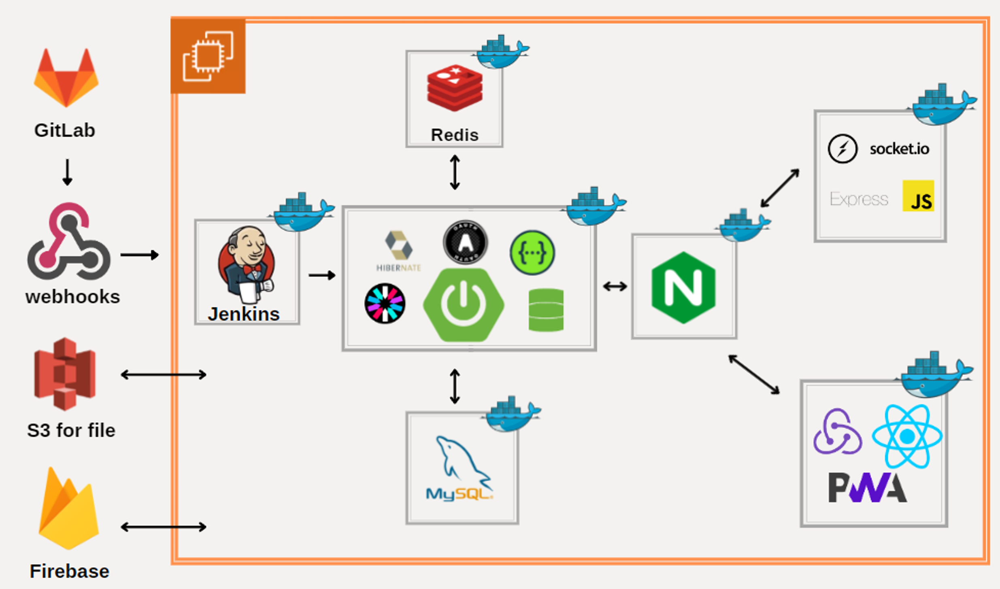

## ✨ EC2 포트 정리

| PORT | 이름 |
| --- | --- |
| 443 | HTTPS |
| 80 | HTTP - HTTPS로 리다이렉트(프론트 페이지지로 리다이렉트) |
| 6379 | Redis |
| 3306 | MySQL |
| 9090 | Jenkins |
| 8080 | Spring boot Docker Container |
| 3000 | React, NginX Docker Container |
| 3478 | React(Express) |

<h1 id="ERD">💽ERD</h1>
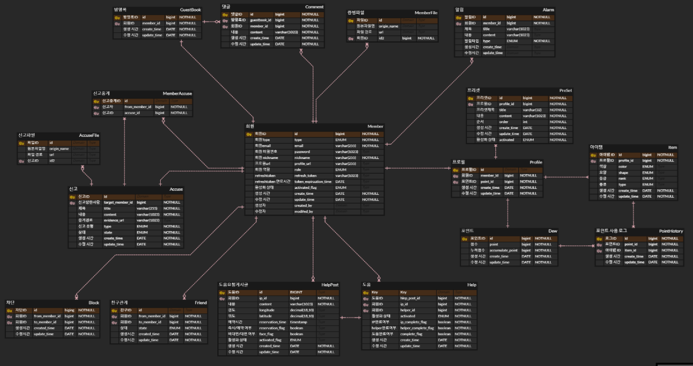

<h1 id="Stack">Stack</h1>

- 프론트엔드
    - React
        - Node 18.16.1
        - React 18.2.0
        - react-router-dom 6.14.2
        - react-redux 8.1.1
        - @reduxjs/toolkit 1.9.5
        - styled-components 6.0.4
        - socket.io-client 2.3.0
        - react-speech-recognition 3.10.0
- 백엔드
    - Java 11.0.20
    - Spring
        - Spring Boot 2.7.13,
        - OAuth2
        - Spring Data JPA 2.7.13
        - querydsl 5.0.0
        - Junit5 5.8.2
    - Express
        - Node 18.16.1
        - Express 4.18.2
        - mongoose 7.4.1
        - socket.io 2.3.0
        - cors 2.8.5
- 데이터베이스
    - MySQL
    - Redis
    - MongoDB
- 인프라
    - AWS EC2
    - AWS S3
    - Docker
    - Jenkins

<h1 id="협업">협업</h1>

- Notion
    - 회의가 있을 때 마다 회의록을 기록해 보관
    - 기술 공부 시 문서를 작성해 팀원과 공유
    - 기능명세서, ERD, REST API 등 모두가 공유해야하는 문서 관리
    - 컨벤션 관리
    - 간트차트 관리
- Gitlab
    - Git을 사용한 버전관리
- Jira
    - 매주 목표량을 설정해 Sprint 진행
    - 업무의 할당량을 정해 Story Point를 설정하고, In-Progress → Done 순으로 작업
- Figma
    - 화면 설계서 작성
    

<h1 id="주요기능">주요 기능</h1>

## 1. 주요 사용자 연령층을 고려한 친화적 UI/UX
- 크고 직관적인 UI
    - 국내 등록 장애인 약 264만명 중 50세 이상 79.% (출처 : 보건복지부)
    - 시력이 좋지 않거나 기존의 UI를 어려워 하는 주요 연령층을 위해 크고 직관인 UI구성
    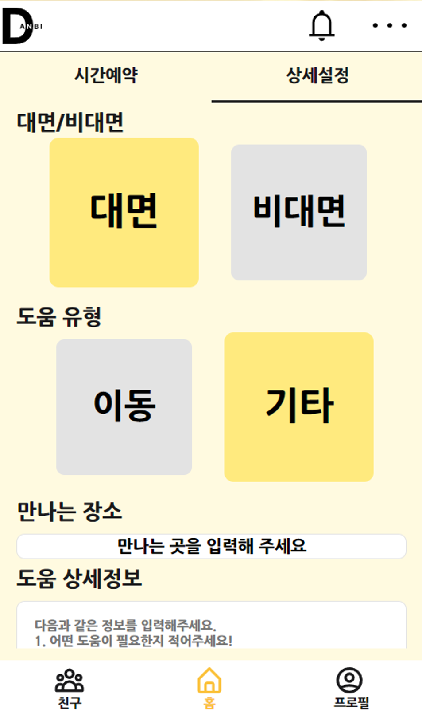

## 2. 서비스 특성을 고려한 PWA구현
- 모바일에 특화되어있는 서비스 특성을 고려해 PWA를 구현
- 스마트폰에 최적화된 UI를 고려하여 PC화면을 구성
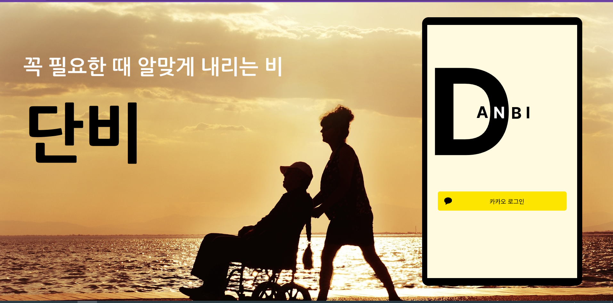

## 3. WebRTC를 이용한 화상통화 및 채팅기능
- Express
    - WebRTC 및 채팅을 위한 별도의 서버구축
    - 주요기능을 지원하는 Spring서버와는 별개의 서버를 구축하여 안정성 증가
- Socket.io
    - Socket.io를 이용해 1:1 P2P로 화상통화 구현
    - Socket.io를 이용해 채팅 구현
- 채팅기록 저장 및 불러오기
    - MongoDB
        - 채팅기록을 저장하기 위해 SQL기반 DB보다 간단하고 빠르게 저장할 수 있는 No-SQL 도입
    - 채팅기록 캐싱
        - 서버과부화를 막기 위해 채팅방 별로 메시지 캐싱
        - 채팅방 입장 및 퇴장시 캐싱한 메시지 DB에 저장
        - 채팅칠 때마다 저장하던 방식과 달리 DB-Write횟수가 줄어들어 안정성 및 속도 증가

## 4. 목소리만으로 간단하게 사용할 수 있는 STT기능
- react-peech-recognition 라이브러리를 사용하여 사용자의 목소리만으로 입력을 지원


## 5. Gamification을 이용한 Reward 시스템
- 도움 일지를 시각화
- 도움을 주고 받을 때마다 Reward (Dew Point)제공
- 도움일지를 꾸밀 수 있는 확률형 아이템 도입
    - Reward를 소모하여 아이템을 뽑음(rare/epic/legend)
    - 나만의 도움일지를 꾸며 성취욕을 자극
    

## 6. OAuth와 JWT를 사용한 인증/인가

- OAuth
    - 외부 서비스를 통한 인증 및 권한 관리
- JWT

## 7. FCM을 사용한 알림

- 교차 플랫폼 메시징 서비스
    - 메세징을 클라이언트의 플랫폼에 종속되지 않고 메세지를 전송할 수 있어 구현의 복잡성을 낮춰줌
- 비동기 요청
    - 서버가 메시지의 응답을 기다리는 동안 블로킹으로 인한 성능 저하를 방지하고자 `sendAsync()` 를 사용하여 메시지를 비동기적으로 처리
    - 여러 요청을 동시에 보내기 때문에 더 빠른 응답 속도
    - 현재 스레드가 Blocking 되지 않고 다른 작업을 수행가능
    - 더 적은 수의 리소스(스레드)로 더 많은 양의 요청을 처리가능

## 8. Redis를 사용한 Token의 신선도 관리

- FCM 토큰
    - 로그인 시에 클라이언트는 FCM 토큰(단말 토큰)을 서버에 전달하게 되는데 서버는 해당 토큰을 스토리지에 저장한 다음, 활성 토큰의 목록을 유지해야 함
    - FCM 공식 문서에 있는 [토큰 관리 Best practice](https://firebase.google.com/docs/cloud-messaging/manage-tokens?hl=ko)에 따르면 토큰의 신선도 보장을 위해서 2개월 이상 사용되지 않은 토큰은 삭제하는 것을 권장
- JWT의 Access-Token 보안 강화
    - 회원이 로그아웃을 했을 때 access-token을 만료시킬 방법이 없었다.
    - 이를 로그아웃 시 Redis에 저장해 해당 access-token 을 만료시키는 효과를 볼 수 있다.
    - 이 후 접근하는 유저의 access-token을 확인해 redis에 있다면 만료되었거나 탈취된 토큰이라고 판단해 접근을 막을 수 있다.
- Redis를 토큰 관리 저장소로 선택하게된 이유
    - 토큰 갱신 및 삭제 연산이 빈번하게 발생
    - 토큰의 데이터가 `key-value` 형태라는 점
    - 타임 스탬프를 통해서 토큰의 신선도를 관리가능

## 9. AWS S3 를 사용한 파일 관리

- 사용 용도
    - 장애인 회원의 인증을 위한 증명 파일을 S3에 저장
    - 회원 신고시 증거 파일 저장
- 사용 이유
    - S3는 저장 용량이 무한대이고 파일 저장에 최적화되어 있다. 용량을 추가하거나 성능을 높이는 작업이 필요없다.
    - 비용은 EC2와 EBS로 구축하는 것보다 훨씬 저렴
    - S3 자체가 수천 대 이상의 매우 성능이 좋은 웹 서버로 구성되어 있어서 EC2와 EBS로 구축했을 때 처럼 Auto Scaling이나 Load Balancing에 신경쓰지 않아도 된다.

## 10. Jenkins와 Docker를 활용한 CI/CD

## 11. Nginx를 활용한 Reverse Proxy 기능

- SSL Termination 기능
    - 암호 해독 프로세스의 속도를 높이고 백엔드 서버의 처리 부담을 줄임
    - 서버가 SSL 세션의 SSL(Secure Socket Layer) 연결에서 데이터를 수신할 때 암호화된 https 트래픽을 가로챔
    - SSL Termination 또는 SSL Offloading은 애플리케이션 서버 대신 로드밸런서의 데이터를 해독하고 확인합니다. 들어오는 연결을 구성할 필요 없이 서버는 웹페이지 로드와 같은 다른 작업의 우선 순위를 지정할 수 있음
    - 그래서 서버 속도를 높이는 데 도움이 됩니다. SSL Termination는 SSL 연결의 끝 또는 종료 지점을 나타냄

- 서버 보안 강화

<h1 id="Git컨벤션">✨Git 컨벤션</h1>

```jsx
feat:     새로운 기능을 추가할 경우
hotfix:      버그를 고친 경우
style :   코드 포맷 변경, 간단한 수정, 코드 변경이 없는 경우
refactor: 프로덕션 코드 리팩토링
docs:     문서를 수정한 경우(ex> Swagger)
rename:   파일 혹은 폴더명 수정 및 이동
remove:   파일 삭제
chore:    빌드 업무 수정(ex> dependency 추가)
```

```jsx
커밋 타입: 내용 자세히 적어주기 [#지라이슈넘버]
ex) FEAT: 로그인 rest api 추가 [#지라이슈넘버]
```

<h1 id="팀소개">👨‍👩‍👧역할 및 팀원 소개</h1>

## 단비팀 멤버들을 소개합니다!

| Front end & Express | Front end | Front end | Back end & CI/CD | Back end | Back end & CI/CD |
| --- | --- | --- | --- | --- | --- |
| |  |  |  |  |  |
| 한승현<br>(PM, FE팀장) | 강민석 | 윤태웅 | 김윤욱<br>(백엔드 팀장) | 김민규 | 조영재 |